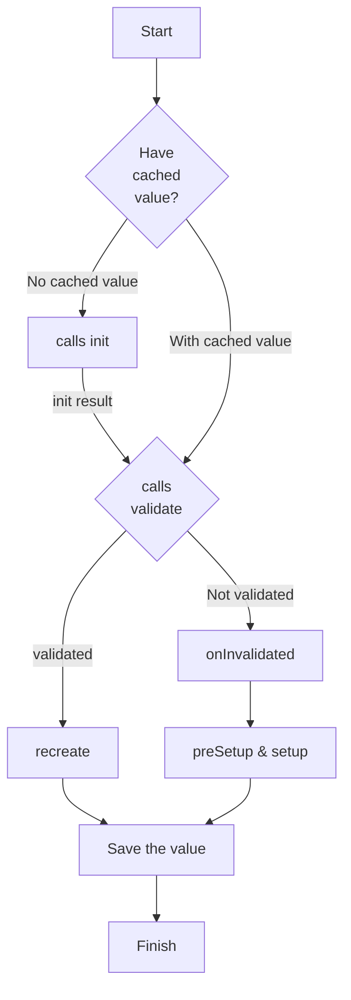

# cypress-auth

Extend test package for Auth utilizing `cypress-data-session`.

```bash
# acquire cypress.env.json file from a colleague, place it next to cypress.json
yarn
yarn cy:open # with Cypress runner
yarn cy:run # headless
```

The main function `maybeGetTokenAndUser` utilizes `cypress-data-session` in order to:

- re-use a token from the session if it has ever been used before, ask for a new one if not - `maybegetToken`.
- check if there is a user in the DB:

  - re-use if there is
  - generate a new user if not

  Save the user to the session in either case, so that next time it is used immediately.

```js
const superadmin: User = {
  role: 'superadmin',
  // usually we do not want to keep creating superAdmins, so use the default
  email: Cypress.env('SUPERADMIN_EMAIL'),
  password: Cypress.env('SUPERADMIN_PASSWORD')
}
const admin: User = {
  role: 'admin',
  email: `some-admin@helloextend.com`,
  password: 'abc123'
}
const user: User = {
  role: 'user',
  email: `some-user@helloextend.com`,
  password: 'abc123'
}
const merchantagent: User = {
  role: 'merchantagent',
  email: `some-merchantagent@helloextend.com`,
  password: 'abc123'
}

// pass the session name you want as the first arg, this can be anything
// pass the user you want to re-use or generate as the second arg

cy.maybeGetTokenAndUser('superadminSession', superadmin)

cy.maybeGetTokenAndUser('adminSession', admin)

cy.maybeGetTokenAndUser('userSession', user)

cy.maybeGetTokenAndUser('merchantagentSession', merchantagent)
```

## The logic as documented in the [Gleb's docs](https://github.com/bahmutov/cypress-data-session/blob/main/README.md)

- First, the code pulls cached data for the session name.

- if there is no cached value:

  - it calls the `init` method, which might return a value _(ex: a token)_
    - if there is a value && passes `validate` callback _(ex: cy.me() returns truthy)_
      - it calls `recreate`, saves the value in the data session and finishes
    - else it needs to generate the real value and save it _(ex: cy.me() returns falsey, fails validate())_
      - it calls `onInvalidated`, `preSetup` and `setup` methods and saves the value

- else (there is a cached value):
  - it calls `validate` with the cached value
    - if the `validate` returns `true`, the code calls `recreate` method
    - else it has to recompute the value, so it calls `onInvalidated`, `preSetup`, and `setup` methods

## Test 1 Flowchart - cached value

<!--  -->


## Test 2 Flowchart - no cached value

<!--  -->


<details>
  <summary>Flowchart source</summary>

<!--
Mermaid charts can be previewed using VSCode extension
Name: Markdown Preview Mermaid Support
Id: bierner.markdown-mermaid
VS Marketplace Link: https://marketplace.visualstudio.com/items?itemName=bierner.markdown-mermaid
-->



</details>
