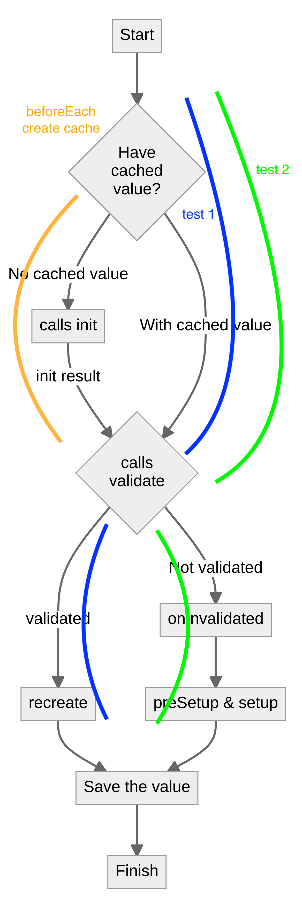
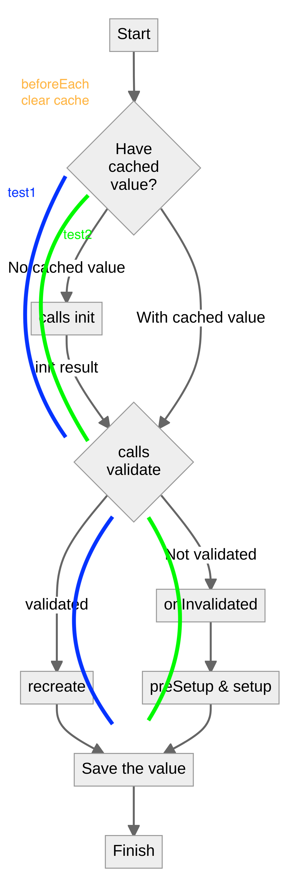
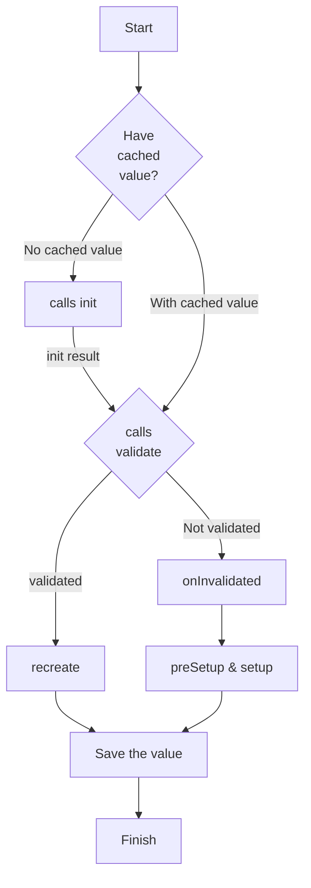

# cypress-auth

[](https://github.com/helloextend/cypress-auth/actions/workflows/cypress-auth.yml) [![renovate-app badge][renovate-badge]][renovate-app]  

> Extend test package for Auth & Users, utilizing [cypress-data-session](https://github.com/bahmutov/cypress-data-session).
> Intended to reduce common e2e test code between teams.

- [cypress-auth](#cypress-auth)
  - [Install](#install)
  - [Use](#use)
    - [`cy.maybeGetTokenAndUser`](#cymaybegettokenanduser)
    - [`cy.maybegetToken`](#cymaybegettoken)
    - [Generic helpers, not using cypress-data-session](#generic-helpers-not-using-cypress-data-session)
      - [`cy.getToken`](#cygettoken)
      - [`cy.getUser`](#cygetuser)
      - [`cy.me`](#cyme)
      - [`cy.deleteUser`](#cydeleteuser)
  - [Test this repo locally on your setup](#test-this-repo-locally-on-your-setup)
  - [The data-session logic as documented in the Gleb's docs](#the-data-session-logic-as-documented-in-the-glebs-docs)
  - [Test 1 Flowchart - cached value](#test-1-flowchart---cached-value)
  - [Test 2 Flowchart - no cached value](#test-2-flowchart---no-cached-value)
  - [Release](#release)

## Install

```bash
# individual repo
$ yarn add -D @extend/cypress-auth
# monorepo
$ yarn add -D -W @extend/cypress-auth
```

Import this package from the support file `cypress/support/index.js`.

```bash
import '@extend/cypress-auth'
```

Setup the types at `cypress/tsconfig.json`.

```json
{
  "compilerOptions": {
    "types": ["cypress", "@extend/cypress-auth"],
    "target": "esnext",
    "lib": ["esnext", "dom"],
    "allowJs": true,
    "resolveJsonModule": true
  },
  "include": ["**/*.ts"]
}
```

## Use

### `cy.maybeGetTokenAndUser`

Utilizes `cypress-data-session` in order to:

- re-use a token from the _session_ if it has ever been used before, ask for a new one if not - `cy.maybeGetToken`.

  > A _session_ is all the specs in your view of the Cypress runner or all the specs running in a CI machine.

- check if there is a user in the DB:

  - re-use if there is
  - generate a new user if not

  Save the user to the session in either case, so that next time it is used immediately.

```js
// create some user

// note: usually we do not want to keep creating superAdmins, so use the default
const superadmin: User = {
  role: 'superadmin',
  email: Cypress.env('SUPERADMIN_EMAIL'),
  password: Cypress.env('SUPERADMIN_PASSWORD')
}
const admin: User = {
  role: 'admin',
  email: `some-admin@helloextend.com`,
  password: 'abc123'
}
const user: User = {
  role: 'user',
  email: `some-user@helloextend.com`,
  password: 'abc123'
}
const merchantagent: User = {
  role: 'merchantagent',
  email: `some-merchantagent@helloextend.com`,
  password: 'abc123'
}

// pass the session name you want as the 1st arg,
// this can be anything and will be shared across specs

// pass the user you want to re-use or generate as the 2nd arg

cy.maybeGetTokenAndUser('superadminSession', superadmin)

cy.maybeGetTokenAndUser('adminSession', admin)

cy.maybeGetTokenAndUser('userSession', user)

cy.maybeGetTokenAndUser('merchantagentSession', merchantagent)
```

### `cy.maybegetToken`

Saves on redundant calls to get a token if we already have one in the session.

```javascript
cy.maybeGetToken('sanitySession', 'some@email.com', 'somePassword').should(
  'not.be.empty'
)
```

### Generic helpers, not using cypress-data-session

#### `cy.getToken`

Asks for a token every time.

```javascript
cy.getToken('some@email.com', 'somePassword').should('not.be.empty')
```

#### `cy.getUser`

Queries the users endpoint for the user, but as somebody else with high priviledeges such as an admin.

```javascript
// assume we have acquired an admin token previously
// and a user object already exists
cy.getUser(adminToken, user.id)
  .its('body')
  .should('have.contain', {
    accountId: user.accountId,
    email: user.email,
    firstName: user.firstName,
    id: user.id,
    lastName: user.lastName,
    role: user.role
  })
  .and('not.have.property', 'accessToken')
```

#### `cy.me`

In contrast to querying users endpoint as an admin, queries the identity endpoint for the user's self, yields the user, decorates it with a token.

```javascript
// assume a user object has been created
cy.me(user.accessToken).should('have.contain', {
  accountId: user.accountId,
  email: user.email,
  firstName: user.firstName,
  id: user.id,
  lastName: user.lastName,
  role: user.role,
  accessToken: user.accessToken
})
```

#### `cy.deleteUser`

Using an admin token, deletes the user by id.

```javascript
cy.deleteUser(superadminToken, user.id)
```

## Test this repo locally on your setup

```bash
# clone, cd in, acquire cypress.env.json file from a colleague, place it next to cypress.json
login
nvm use
yarn
yarn cy:open # with Cypress runner
yarn cy:run # headless
```

## The data-session logic as documented in the [Gleb's docs](https://github.com/bahmutov/cypress-data-session/blob/main/README.md)

- First, the code pulls cached data for the session name.

- if there is no cached value:

  - it calls the `init` method, which might return a value _(ex: a token)_
    - if there is a value && passes `validate` callback _(ex: cy.me() returns truthy)_
      - it calls `recreate`, saves the value in the data session and finishes
    - else it needs to generate the real value and save it _(ex: cy.me() returns falsey, fails validate())_
      - it calls `onInvalidated`, `preSetup` and `setup` methods and saves the value

- else (there is a cached value):
  - it calls `validate` with the cached value
    - if the `validate` returns `true`, the code calls `recreate` method
    - else it has to recompute the value, so it calls `onInvalidated`, `preSetup`, and `setup` methods

## Test 1 Flowchart - cached value

<!--  -->


## Test 2 Flowchart - no cached value

<!--  -->


<details>
  <summary>Flowchart source</summary>
<!--
Mermaid charts can be previewed using VSCode extension
Name: Markdown Preview Mermaid Support
Id: bierner.markdown-mermaid
VS Marketplace Link: https://marketplace.visualstudio.com/items?itemName=bierner.markdown-mermaid
-->



</details>

## Release

At the time being releases are done locally. Release while on `main`, and push to `main` the update `package.json` which will have a new version number.

```bash
# builds the app (dist folder)
# updates package version in the root package.json
# creates a package.json copy at dist folder
# copies the types and dependency types to the dist foler
# publishes to AWS CodeArtifact
yarn release
```

[renovate-badge]: https://img.shields.io/badge/renovate-app-blue.svg
[renovate-app]: https://renovateapp.com/
